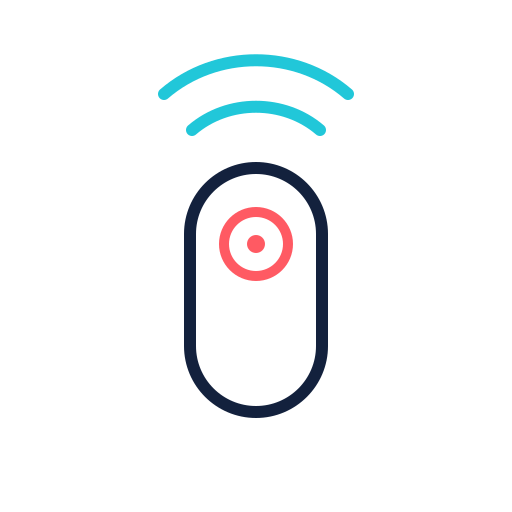

<p align="center">
  
</p>

# TV Kumandam

Android telefonun dahili kızılötesi vericisiyle televizyonları kontrol eden açık kaynak TV kumandası. Özelleştirilebilir makrolar sayesinde birden fazla kumanda komutunu tek tuşla çalıştırır. İnternet, Wi-Fi, Bluetooth veya kullanıcı hesabı gerektirmez.

_An offline, open-source Android IR TV remote with programmable one-tap macros, built with Kotlin and Jetpack Compose._

## Özellikler

- Android `ConsumerIrManager` ile gerçek IR sinyali gönderimi
- Birden fazla TV kaydı ve kumandalar arasında hızlı geçiş
- Model aramalı, iki kısa testten oluşan yönlendirmeli kurulum
- Tek dokunuşla birden fazla TV komutu çalıştıran özelleştirilebilir makrolar
- Kumandanın en üstüne taşınabilen, düzenlenebilir kısayollar
- Açık ve koyu tema
- Tuş titreşimi ve sağ/sol el yerleşimi
- IR vericisi olmayan telefonlarda güvenli hata yönetimi

## Makrolar: birden fazla komut, tek tuş

Makro oluşturucu; kumanda komutlarını istediğiniz sıraya koymanıza, bir komutu tekrarlamanıza ve adımlar arasındaki bekleme süresini belirlemenize olanak tanır. Oluşturulan makro kumandanın kısayollarına eklenebilir ve istenirse ilk sıraya taşınabilir.

Örneğin tek tuşla kaynak menüsünü açabilir, HDMI 1 satırına ilerleyebilir ve seçimi onaylayabilirsiniz. Aynı yapı; kanal dizileri, menü adımları veya art arda gönderilmesi gereken diğer IR işlemleri için de kullanılabilir. Makrolar, normal kumanda tuşlarından ayırt edilebilmesi için uygulamada `MAKRO` etiketiyle gösterilir.

## Desteklenen kumandalar

Yerleşik katalog şu kumanda ailelerini içerir:

- Arçelik, Beko ve Grundig RC-YC1
- LG'nin belgelenmiş eski ve yeni nesil profil aileleri
- Samsung AA59-00484A
- Toshiba CT-8560
- Hitachi CLE-1031
- JVC RM-C3311

Profil kaynakları ve teknik ayrıntılar [IR profil kataloğunda](docs/IR_PROFILES.md) yer alır.

Bir IR kodunun telefondan gönderilebilmesi, her TV modelinde çalışacağını garanti etmez. Sonuç; televizyon modeli, kumanda ailesi ve telefonun IR donanımına bağlıdır.

## Gereksinimler

- Android 6.0 veya üzeri
- Android tarafından kullanıma açılmış dahili IR vericisi (IR blaster)

Uygulama Wi-Fi tabanlı akıllı TV kumandası değildir. Dahili IR vericisi olmayan telefonlara kızılötesi özelliği kazandırmaz.

## APK kurulumu

İmzalı APK'lar yalnızca [GitHub Releases](https://github.com/erkanpulat/tv-kumandam/releases) bölümünde yayımlanır. Sayfada bir sürüm görünmüyorsa APK henüz dağıtıma sunulmamıştır; uygulamayı aşağıdaki adımlarla kaynaktan derleyebilirsiniz. Android, GitHub'dan indirilen APK için kurulum izni isteyebilir.

Geliştirme sırasında oluşturulan debug APK'yı ADB ile kurmak için:

```bash
adb install -r app/build/outputs/apk/debug/app-debug.apk
```

## Kaynaktan derleme

Android Studio zorunlu değildir. JDK 17, Android SDK Platform 37.0 ve Build Tools 36.0.0 yeterlidir.

Windows PowerShell:

```powershell
.\scripts\gradle.ps1 assembleDebug
```

Linux ve macOS:

```bash
./gradlew assembleDebug
```

Debug APK şu konumda oluşturulur:

```text
app/build/outputs/apk/debug/app-debug.apk
```

Ayrıntılı ortam kurulumu için [Android Studio olmadan derleme](docs/BUILDING_WITHOUT_ANDROID_STUDIO.md) belgesine bakın.
Dağıtılabilir imzalı APK hazırlamak için [sürüm yayımlama](docs/RELEASING.md) belgesini izleyin.

## Kullanım

1. İlk açılışta **TV'mi ekle** seçeneğine dokunun. Daha sonra **TV'ler** ekranından yeni bir TV ekleyebilirsiniz.
2. Marka ve modeli seçin veya model adını arayın. Modeli bilmiyorsanız **Modelimi bilmiyorum** seçeneğini kullanın.
3. Telefonu TV'nin IR alıcısına doğrultup Güç ve Ses + komutlarını test edin.
4. Çalışan kumandayı adlandırıp kaydedin.

Kumanda ekranındaki **Düzenle** seçeneğiyle sık kullanılan tuşlar sıralanabilir ve makrolar oluşturulabilir. Yeni bir makroyu doğrudan kısayollara ekleyebilir veya daha sonra istediğiniz konuma taşıyabilirsiniz.

## Teknik yapı

- Kotlin
- Jetpack Compose ve Material 3
- MVVM tabanlı sunum katmanı
- Android DataStore ile yerel ayarlar
- Protokolden bağımsız IR komut modeli
- NEC, RC5, Samsung32 ve Sony SIRC kodlayıcıları

Katmanlar ve veri akışı [ARCHITECTURE.md](docs/ARCHITECTURE.md) belgesinde açıklanır.

## Test

```bash
./gradlew testDebugUnitTest lintDebug assembleDebug assembleRelease assembleDebugAndroidTest
```

IR işlevi emülatörde doğrulanamaz. Fiziksel test için dahili IR vericisi olan bir Android telefon gerekir. Kontrol listesi: [DEVICE_TESTING.md](docs/DEVICE_TESTING.md)

## Katkı ve güvenlik

Katkı göndermeden önce [CONTRIBUTING.md](CONTRIBUTING.md) dosyasını okuyun. Hataları [GitHub Issues](https://github.com/erkanpulat/tv-kumandam/issues) üzerinden bildirebilirsiniz.

Güvenlik açıklarını herkese açık issue olarak paylaşmayın; [SECURITY.md](SECURITY.md) içindeki özel bildirim yolunu kullanın.

## Gizlilik ve lisans

TV kayıtları, makrolar ve tercihler yalnızca cihazda saklanır. Uygulamada reklam, analiz veya telemetri SDK'sı yoktur. Ayrıntılar [PRIVACY.md](PRIVACY.md) dosyasındadır.

Kaynak kod [MIT Lisansı](LICENSE) ile yayımlanır. IR veri kaynakları ve lisansları [NOTICE.md](NOTICE.md) dosyasında belirtilir.

TV Kumandam bağımsız bir projedir. Marka adları yalnızca uyumluluk amacıyla kullanılır; üretici onayı veya ortaklığı ifade etmez.
